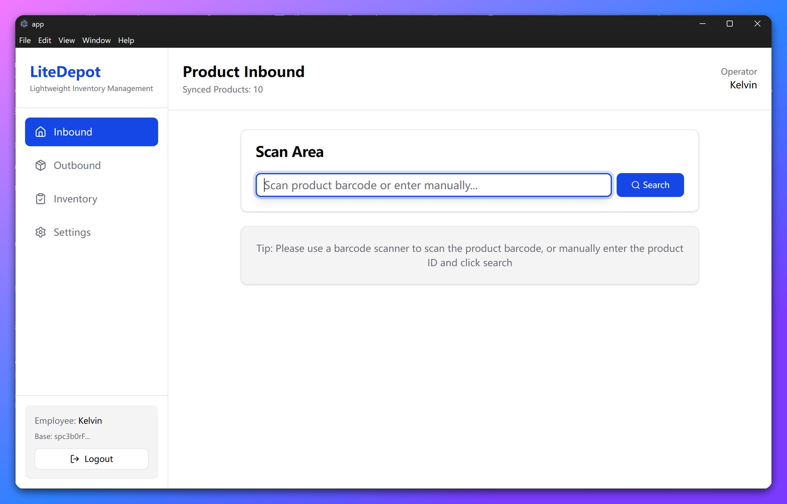
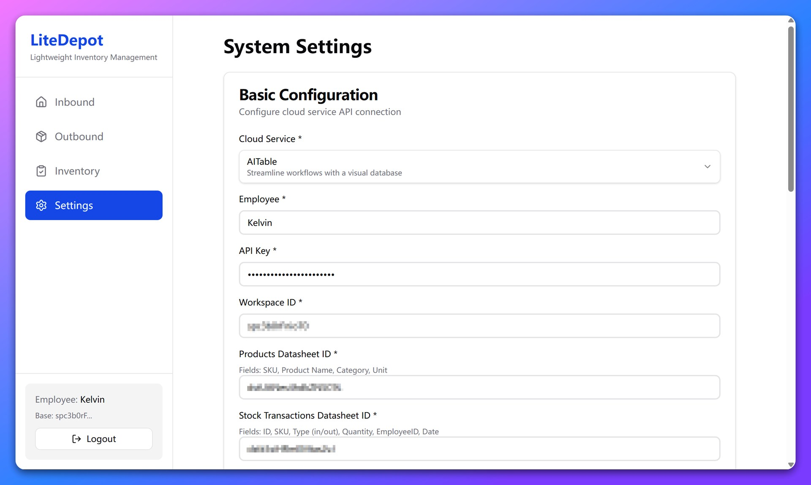

git clone https://github.com/kwp-lab/Lite-depot.git
# LiteDepot - Lightweight Inbound / Outbound Inventory Client

**Language:** [English](./README.md) | [中文](./README.zh.md)

LiteDepot is a desktop demo application targeting warehouse inbound/outbound registration scenarios. It uses online SaaS spreadsheet platforms (AITable, Bika, Vika, etc.) as the backend data source and is packaged via Electron. It helps warehouse operators quickly perform product inbound, outbound, and (planned) inventory auditing using a barcode scanner.



## Core Features

- ✅ **Fast Barcode Operations** – Perform inbound, outbound, and inventory with a scanner
- ✅ **No Account System** – Just enter an API Key for the cloud service to start
- ✅ **Dynamic Schema** – Automatically reads remote table schema and renders dynamic forms
- ✅ **Batch Outbound** – Scan multiple products and submit a single outbound transaction
- ✅ **Offline Capability** – Locally caches product list; still searchable when network fails
- ✅ **Fullscreen Scan Mode** – Optimized for fixed warehouse scanning stations
- ✅ **Multi Provider Support** – Works with AITable, Bika, Vika (extensible architecture)
- ✅ **I18N Support** – Multi-language (currently Chinese & English)

## Main Workflows

### 📦 Inbound Flow
1. Click left navigation "Inbound"
2. Scan or manually enter product code
3. System auto-identifies and displays product details
4. Click "Confirm Inbound" to finish

### 📤 Outbound Flow (Batch Supported)
1. Click left navigation "Outbound"
2. Scan multiple products to add them to the outbound basket
3. Click "Submit Outbound" to process all items together

### 📋 Inventory Flow (Todo)
1. Click left navigation "Inventory"
2. Scan product; system logs inventory timestamp
3. View real-time counted records and total
4. Click "Finish Inventory" to see uncounted product summary

### ⚙️ Settings
- Modify cloud API config, field mapping, table mapping
- Clear local cache
- Sync product list

## Quick Start

### Prerequisites

1. **Prepare Your Data Tables**
	- Open [AITable.ai](https://aitable.ai) or [Bika.ai](https://bika.ai)
	- Import the sample Excel file: `./mock_data/warehouse_demo_en.xlsx` containing two sheets: `Products` and `StockTransactions`
2. **Obtain API Credentials**
	- Get your API Token in AITable
	- Get your `space ID`
	- Open the imported `Products` table and copy its table ID from the URL (starts with `dst`)
	- Open the imported `StockTransactions` table and copy its table ID from the URL (starts with `dst`)

### Launch the App

1. **Run the Client**
	```
	Double-click LiteDepot-1.0.0-portable.exe
	```
2. **First-Time Setup** – Fill in required parameters in the Settings page
   
	
3. **Sync Product Data** – In Settings → "Data Management" click "Sync Product List" to pull remote products into local cache
4. **Start Using**
	- **Inbound:** Scan product → Confirm inbound
	- **Outbound:** Scan multiple products → Batch submit outbound
	- **Inventory:** Scan product → Record timestamp (UI only; business logic pending)

> 💡 Tip: No scanner? Manually enter product SKU to test.

## Development

### Tech Stack

- **Client Framework:** Electron
- **UI Framework:** React + TypeScript
- **Styling:** TailwindCSS + shadcn/ui
- **State Management:** Zustand
- **Local Storage:** IndexedDB
- **Build Tool:** Vite

### Environment Requirements

- Node.js >= 18
- pnpm >= 8

### Install Dependencies
```bash
pnpm install
```

### Development Mode
Start Electron with hot reload:
```bash
pnpm dev
```

### Build Application
Build all or target specific OS:
```bash
pnpm build
pnpm build:win
pnpm build:mac
```
Artifacts are generated in `release/`.

### Project Structure
```
src/
├── api/                  # API layer
│   ├── aitable.ts       # AITable implementation
│   ├── base-provider.ts  # Provider base class
│   └── provider-factory.ts # Provider factory
├── components/           # UI components
│   └── ui/               # shadcn/ui components
├── db/                   # IndexedDB local database
├── pages/                # Page components
│   ├── InboundPage.tsx   # Inbound page
│   ├── OutboundPage.tsx  # Outbound page
│   ├── InventoryPage.tsx # Inventory page
│   └── SettingsPage.tsx  # Settings page
├── store/                # Zustand stores
│   ├── configStore.ts    # Configuration state
│   ├── productStore.ts   # Product state
│   └── inventoryStore.ts # Inventory state
└── types/                # Type definitions
```

### Extending Cloud Providers
LiteDepot uses a provider architecture to easily support new SaaS platforms.

1. Create a new provider class under `src/api/`, extending `BaseProvider`
2. Implement required interface methods:
	- `getFields()` – Fetch field schema
	- `getRecords()` – Fetch record list
	- `updateRecord()` – Update a single record
	- `batchUpdateRecords()` – Batch update multiple records
3. Register the provider in `provider-factory.ts`

Example:
```typescript
export class NotionProvider extends BaseProvider {
  async getFields(): Promise<Field[]> {
	 // Implement Notion API field retrieval
  }
  async getRecords(): Promise<Record[]> {
	 // Implement Notion API record retrieval
  }
  // ... other method implementations
}
```

### Debugging Tips
- Use Electron DevTools (auto-opens in dev)
- View IndexedDB: DevTools → Application → IndexedDB
- Inspect network requests: DevTools → Network

### Code Quality
ESLint is configured:
```bash
pnpm lint
```

## FAQ

### Q: Why does scanning show "Product Not Found"?
A: Check:
1. Have you synced the product list in Settings?
2. Does the scanned value match the product code field in the table?
3. Is the network connection stable?

### Q: How to clear local cache?
A: Go to Settings, click "Clear Local Cache", then re-sync product list.

---
**LiteDepot** – Making product handling simpler.
